---
output:
  xaringan::moon_reader:
    css: [default, "xaringan_themer.css"]
    nature:
      slideNumberFormat: "%current%"
      countIncrementalSlides: false
    seal: false
---

```{r setup, include=FALSE}
xaringanExtra::use_panelset()
suppressWarnings(suppressPackageStartupMessages(library(DT)))
knitr::opts_chunk$set(python.reticulate = FALSE)
```

<!------------------------------------------------------->
<style>
.first-slide {
  text-align: center;
  padding-top: 20px; /* Increased padding to push content down */
}
.logos {
  display: flex;
  justify-content: space-between;
  margin-top: 20px; /* Added margin to lower logos */
  margin-bottom: 10px;
}
.logos img {
  height: 100px; /* Logos remain large for visibility */
}
.bold-line, .small-line {
  border-top: 3px solid #2a2445;
  margin: 35px auto; /* Consistent spacing for lines */
}
.bold-line {
  width: 100%;
  border-top-width: 5px;
}
.small-line {
  width: 90%;
}
.title, .subtitle {
  color: #0c4aa0;
  text-align: center;
  font-family: 'Calibri';
}
.title {
  font-size: 2.5em;
  font-weight: bold;
  margin-bottom: 10px;
}
.subtitle {
  font-size: 1.5em;
  font-weight: bold;
  margin-bottom: 20px;
}
.footer {
  display: flex;
  justify-content: space-between;
  font-size: 1em;
  color: #2a2445;
}
</style>

<div class="logos">
  
  
  
  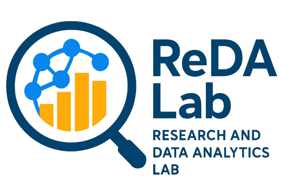

</div>

<div class="bold-line"></div>

<div class="title">Building AI Chatbot for Tax Agent in Khmer Language </div>
<div class="small-line"></div>

<div class="subtitle"> Institute of Technology of Cambodia</div>

<div class="subtitle">Department of Applied Mathematics and Statistics</div>

<div class="subtitle">Internship Defense </div>

<div class="footer">
  <div><b>Presented by</b> :<br><b>KOSAL Chansothay</b>
  <br> e20210574
  </div>
  <div>
  <b>Date: 07 November 2025</b>
  <br>
  <b> Advisor : Mr. TOUCH Sopheak</b>
  <br> Lecturer at ITC
  </div>
  <div>
  <b>Supervisor</b> : <br><b>Mr. HIM Soklong</b>
  <br> Lecturer at CADT
  </div>
</div>

<!-- End for the cover slide -->

---

<!-- Table of Contents -->

# Table of Contents

<div class="toc-box">
  <div class="toc-item color1"><span class="number">01</span>  1. Introduction:</div>
  
--
  
  <div class="toc-item color2"><span class="number">02</span> 2. Objectives:</div>
  
--
  
  <div class="toc-item color3"><span class="number">03</span> 3. Methodology:</div>
  
--
  
  <div class="toc-item color4"><span class="number">04</span> 4. Results and Conclusion :</div>
  
--
  
  <div class="toc-item color5"><span class="number">05</span> 5. Future Work:</div>
  
--
  
  <div class="toc-item color6"><span class="number">06</span> 6. References:</div>
</div>
<!-- End for the TOC slide -->

---

# Introduction
This project aims to develop an **AI chatbot** specifically designed for tax agents in Cambodia, utilizing the Khmer language. 
The chatbot will be built using **pretrained model (Qwen 3)** from Alibaba Group, which will be fine-tuned using ** *Row Rank Adaptation (LoRA) with Quantization* ** to understand and respond to tax-related queries in **Khmer**. 

--

The chatbot will be trained on a dataset of **tax-related questions and answers**, ensuring that it can provide accurate and relevant information to users.
Then it will be integrated into a platform where the users can interact with it easily.

.center[]
 .left[.footnote[
[1] Paper: [LoRA: Low-Rank Adaptation of Large Language Models](https://arxiv.org/pdf/2106.09685)]]
 
<!------------------------------------------------------->

---
# Objectives

.pull-left[
The main objectives of this project are:
1.  **Develop an AI chatbot** that can understand and respond to tax-related queries in Khmer language.

2.  **Fine-tune the pretrained model (Qwen 3) using QLoRA** to ensure that the chatbot can provide accurate and relevant information about the Cambodian tax system despite having hardware barrier.

]

.pull-right[
.center[ ]
.center[ 
          <br> Fig : Reparametrization. Only train A and B.]

]

.footnote[
[1] Paper: [QLoRA: Efficient Finetuning of Quantized LLMs](https://arxiv.org/pdf/2305.14314) <br>
[2] Paper: [Qwen 3: Qwen3 Technical Report](https://arxiv.org/pdf/2505.09388) <br>
[3] Paper: [Qwen 2.5: Qwen2 Technical Report](https://arxiv.org/pdf/2412.15115) <br>
]

---

# Internship Timeline

.center[]

- .stress[Phase 1]: At the beginning of the internship, I define topic and scope of the project. 
  - Discuss with advisor regarding the **possibility**
  - **Refine** the idea of implementation and technique based on Literature Review
  - Collect, clean the data and prepare the **environment** for the project
- .stress[Phase 2]: During the internship, I focus on the implementation of the project.
  - Implement the chatbot using the pretrained **model (Qwen 3)**
  - Fine-tune the model using **LoRA** to adapt it to the Khmer language
  
---

# Literature Review

```{r slide-all-papers, echo=FALSE, results='asis'}
suppressWarnings(suppressPackageStartupMessages(library(DT)))

datatable(
  data.frame(
    Paper = c("Attention Is All You Need", "LoRA", "QLoRA"),
    Authors = c("Ashish Vaswani et al.", "Edward J. Hu et al.", "Tim Dettmers et al."),
    Focus = c("Transformer architecture via self-attention", "Low-rank updates to frozen weights", "Fine-tuning quantized weights with LoRA"),
    Contribution = c("Enabled parallel training, replaced recurrence", "Efficient fine-tuning with minimal parameters", "Full 65B model fine-tuning on one GPU"),
    Relevance = c("Need to understand it for Khmer LLMs", "Lightweight Khmer adaptation", "Scalable Khmer fine-tuning"),
    Year = c(2017, 2021, 2023)
  ),
  options = list(
    dom = 't',
    initComplete = JS(
      "function(settings, json) {
         $(this.api().table().header()).css({
           'background-color': '#2C3E50',
           'color': '#fff'
         });
       }"
    )
  ),
  rownames = FALSE,
)
```

.footnote[
[1] Paper: [Attention Is All You Need](https://arxiv.org/pdf/1706.03762) <br>
[2] Paper: [LoRA: Low-Rank Adaptation of Large Language Models](https://arxiv.org/pdf/2106.09685) <br>
[3] Paper: [QLoRA: Efficient Finetuning of Quantized LLMs](https://arxiv.org/pdf/2305.14314)
]  

---

# Literature Review
```{r slide-qwen-family-full, echo=FALSE, results='asis'}
suppressWarnings(suppressPackageStartupMessages(library(DT)))

datatable(
  data.frame(
    Paper = c("Qwen", "Qwen2.5", "Qwen3"),
    Authors = c("Alibaba Group", "Qwen Team", "Qwen Team"),
    Focus = c(
      "Multilingual Transformer foundation model",
      "Scaled training (18T tokens), 1M fine-tuning samples, RLHF",
      "Unified reasoning + chat modes, dynamic thinking budget"
    ),
    Contribution = c(
      "Released open-source 7B and 14B base models",
      "Expanded open-weight series with improved instruction tuning",
      "Released 7 dense and MoE models (0.6B–235B), SOTA multilingual performance"
    ),
    Relevance = c(
      "No explicit mention of Khmer support",
      "No explicit mention of Khmer support",
      "Explicitly includes and evaluates Khmer language support"
    ),
    Year = c(2023, 2024, 2025)
  ),
  options = list(
    dom = 't',
    initComplete = JS(
      "function(settings, json) {
         $(this.api().table().header()).css({
           'background-color': '#2C3E50',
           'color': '#fff'
         });
       }"
    )
  ),
  rownames = FALSE,
)
```

.footnote[

<br>

<br>

Paper: [Qwen3 Technical Report](https://arxiv.org/pdf/2505.09388)
]  

---

# Literature Review
```{r slide-QA-answering, echo=FALSE, results='asis'}
suppressWarnings(suppressPackageStartupMessages(library(DT)))

datatable(
  data.frame(
    Paper = c("Khmer Question-Answering", "Gemma"),
    Authors = c("Ly Kimleang", "Gemma Team, Google DeepMind"),
    Focus = c(
      "Developing a Khmer chatbot using various pretrained models",
      "A lightweight model family built using Gemini's core research and technology."
    ),
    Contribution = c(
      "Pretrained models (e.g., Gemma, Qwen) can effectively capture Khmer context when configured with high-quality datasets.",
      "Releases two model sizes (2B and 7B parameters), with both pretrained and fine-tuned."
    ),
    Relevance = c(
      "Showcase the feasibility of building Khmer chatbots using pretrained models.",
      "Tokenizer supports Khmer, and models are trained on web data that includes Khmer."
    ),
    Year = c(2024, 2024)
  ),
  options = list(
    dom = 't',
    initComplete = JS(
      "function(settings, json) {
         $(this.api().table().header()).css({
           'background-color': '#2C3E50',
           'color': '#fff'
         });
       }"
    )
  ),
  rownames = FALSE
)
```

<div style="font-size: 80%; color: #555;">
Paper: [1] <a href="https://techno-srj.itc.edu.kh/menuscript/22f35616bcba8813b817121c82054d04">Khmer Question-Answering</a>  <br>
Paper: [2] <a href="https://arxiv.org/pdf/2403.08295">Gemma: Open Models Based on Gemini Research and Technology</a>
</div>


---

class: center, middle

# Methodology  
## Fine-tuning Qwen 3 using QLoRA with Quantization (Unsloth)  

#### Efficient Khmer Q&A adaptation via low-rank updates + 4-bit quantized training

.left[.footnote[  
[1] Paper: [QLoRA: Efficient Finetuning of Quantized LLMs](https://arxiv.org/pdf/2305.14314) <br>
[2] Paper: [LoRA: Low-Rank Adaptation of Large Language Models](https://arxiv.org/pdf/2106.09685) <br>
[3] Unsloth Documentation: [Unsloth](https://docs.unsloth.ai/)  
]
]

---
#### Workflow of Fine-tuning: [Unsloth](https://unsloth.ai/)

.center[]


---

class: center, middle

#Background of Large Language Model (LLM)
### Machine Translation Task
.footnote[
[Paper] [Attention is all you need: (Vaswani et al. 2017)](https://arxiv.org/pdf/1706.03762)
]

---

.center[
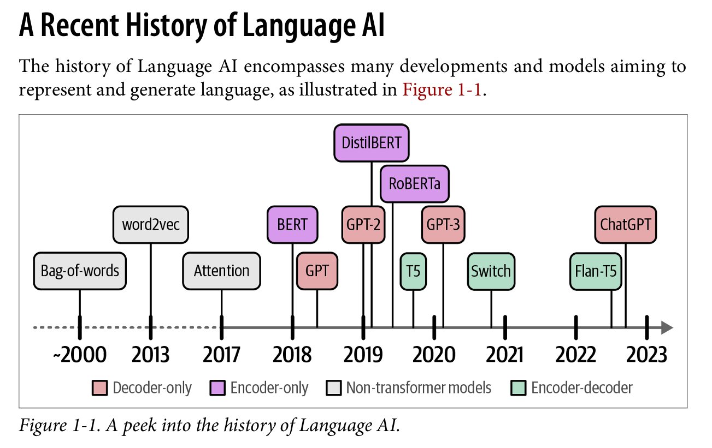
]
.footnote[
Source: [Hands-On Large Language Models](https://www.llm-book.com/)
]

---

## Year of Generative AI

.center[
<div style="text-align: left;">
  
  <div style="font-size: 80%; color: #555;">
    Book: <a href="https://www.llm-book.com/">Hands-On Large Language Models</a>
  </div>
</div>
]


---
.pull-left[
### Transformer Architecture
There are **two main components** in the transformer architecture <br>
- **Encoder**: Processes input and creates hidden representations. It consists of multiple layers of self-attention and feed-forward neural networks <br>
- **Decoder**: Generates output by attending to encoder outputs via cross-attention, along with its own self-attention and feed-forward layers.
- **Add & Norm**: Each sub-layer adds the input to the output of the sub-layer and normalizes it. This helps with training stability and gradient flow.
]

.pull-right[
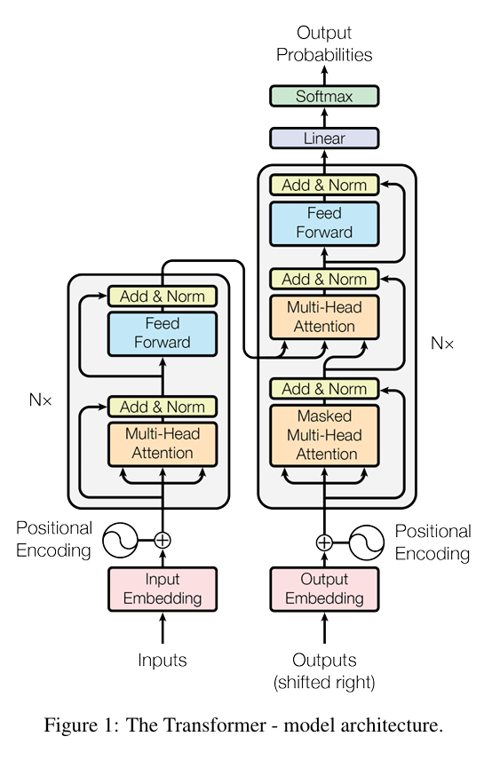
]


.footnote[
[1] Concept Explained: [The Illustrated Transformer](http://jalammar.github.io/illustrated-transformer) <br>
[2] Paper: [Attention is all you need: (Vaswani et al. 2017)](https://arxiv.org/pdf/1706.03762)
]

---

.pull-left[
## How LLMs Modify the Transformer

Modern LLMs like ChatGPT, LLaMA, Gemma, DeepSeek, Claude, and Qwen3, ... often use a **decoder-only** setup: they take a prompt and generate text.

They also apply RMSNorm **pre-layer normalization (In LLaMA, Gemma, Qwen3)** (before attention and feed-forward layers) for better training stability—unlike the original Transformer which used **post-layer normalization.**
]

.pull-right[

]

.footnote[
[1] Paper: [LLaMA: Open and Efficient...](https://arxiv.org/pdf/2302.13971) <br>
[2] Paper: [Qwen3 Technical Report](https://arxiv.org/pdf/2505.09388) <br>
[3] Paper: [Gemma: Gemma: Open Models... ](https://arxiv.org/pdf/2403.08295)
]

---

# Adjustments in LlaMA
.center[

]

Key Changes from Original Transformer
- Uses **RMSNorm** instead of LayerNorm for normalization
- Applies **pre-layer normalization** for better training stability
- Employs **Gated Linear Units (GLU)** like **SwiGLU** for activation in feed-forward layers
- Utilizes **Rotary Positional Embeddings (RoPE)** for encoding positional information


---

# Adjustments in Gemma
.center[

]

Key Changes from Original Transformer
- Utilizes **Rotary Positional Embeddings (RoPE)** for encoding positional information
- **Multi-Query Attention (MQA)** with shared keys and values across attention heads
- **GeGLU activation** in feed-forward layers
- Uses **RMSNorm** with **pre-layer normalization** for better training stability


---
# Adjustments in Qwen family

.center[
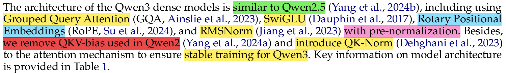
]

.pull-left[
The architecture of the **Qwen3 dense models** is similar to **Qwen2.5** (Yang et al., 2024b), including:

- **Grouped Query Attention (GQA)**  
- **SwiGLU activation**  
- **Rotary Positional Embeddings (RoPE)**  
- **RMSNorm** with **pre-normalization**

Key Changes from Qwen2

- Removed **QKV bias** used in Qwen2  
- Introduced **QK-Norm**  to the attention mechanism
]

.pull-right[

]
---

### Dataset for Fine-tuning (1690 QA pairs)
```{r slide-QA-sample, echo=FALSE, results='asis'}
suppressWarnings(suppressPackageStartupMessages(library(DT)))

datatable(
  data.frame(
    ID = c(1, 2, 3, 4, 5),
    Question = c(
      "តើពន្ធលើប្រាក់បៀវត្សជាអ្វី?",
      "តើរូបវន្តបុគ្គលនិវាសនជននៅក្នុងកម្ពុជាត្រូវជាប់ពន្ធលើប្រាក់បៀវត្សចំពោះប្រាក់បៀវត្សប្រភពណាខ្លះ?",
      "តើរូបវន្តបុគ្គលអនិវាសនជនត្រូវជាប់ពន្ធលើប្រាក់បៀវត្សចំពោះប្រាក់បៀវត្សប្រភពណា?",
      "តើអ្វីទៅជាប្រាក់ប៉ះប៉ូវ?",
      "តើនរណាខ្លះត្រូវជាប់ពន្ធលើប្រាក់បៀវត្ស?"
    ),
    Answer = c(
      "ពន្ធលើប្រាក់បៀវត្ស គឺជាពន្ធប្រចាំខែកំណត់លើប្រាក់បៀវត្សដែលរូបវន្តបុគ្គលបានទទួលក្នុងក្របខ័ណ្ឌនៃការបំពេញសកម្មភាពបម្រើការងារ។",
      "រូបវន្តបុគ្គលនិវាសនជននៅក្នុងកម្ពុជា ត្រូវជាប់ពន្ធលើប្រាក់បៀវត្សចំពោះប្រាក់បៀវត្សប្រភពកម្ពុជា និងប្រាក់បៀវត្សប្រភពបរទេស។",
      "រូបវន្តបុគ្គលអនិវាសនជនត្រូវជាប់ពន្ធលើប្រាក់បៀវត្សចំពោះប្រាក់បៀវត្សប្រភពកម្ពុជា។",
      "ប្រាក់ប៉ះប៉ូវ សំដៅដល់ ប្រាក់ឧបត្ថម្ភដទៃទៀតដែលផ្តល់ឱ្យនិយោជិត ដោយសារការផ្លាស់ទីកន្លែងធ្វើការឆ្ងាយពីលំនៅឋាន ឬការងារដែលមានហានិភ័យជាដើម។",
      "រូបវន្តបុគ្គលដែលបានទទួលប្រាក់បៀវត្សក្នុងក្របខ័ណ្ឌនៃការបំពេញសកម្មភាពបម្រើការងារ ត្រូវជាប់ពន្ធលើប្រាក់បៀវត្ស។"
    )
  ),
  options = list(
    dom = 't',
    initComplete = JS(
      "function(settings, json) {
         $(this.api().table().header()).css({
           'background-color': '#2C3E50',
           'color': '#fff'
         });
       }"
    )
  ),
  rownames = FALSE
)
```

---

# How I collect data?
**PDF courpus -> Image -> Google Lens -> Text -> Annotator (Gemini API) | PDF to Annotator**

.center[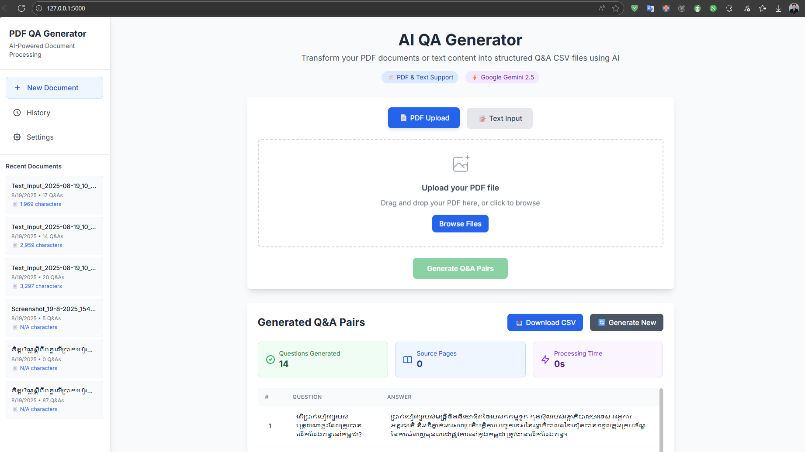]


---
# Khmer QA courpus 1690 pairs
**Data source: PDF from Lecture (Economic for engineer) and GDT website**

.center[]

---

# Tokenizer for in various LLMs
.center[

]
```{r slide-tokenizer-comparison, echo=FALSE, results='asis'}
suppressWarnings(suppressPackageStartupMessages(library(DT)))

datatable(
  data.frame(
    Model = c("LLaMA", "Qwen3", "Gemma"),
    Type = c("Byte Pair Encoding (BPE)", "Byte-level Byte-Pair Encoding
 (BBPE)", "SentencePiece (SP)"),
    VocabSize = c("32,000 tokens", "151,669 tokens", "256k tokens."),
    KhmerSupport = c("No explicit support", "Yes, includes Khmer", "Yes, includes Khmer"),
    TrainingData = c(
      "English-centric web data",
      "Multilingual web data including Khmer",
      "Web data including Khmer"
    )
  ),
  options = list(
    dom = 't',
    initComplete = JS(
      "function(settings, json) {
         $(this.api().table().header()).css({
           'background-color': '#2C3E50',
           'color': '#fff'
         });
       }"
    )
  ),
  rownames = FALSE
)
```

---

## Gemma Tokenizer Example

```python
# Load the tokenizer
tokenizer = gm.text.Gemma3Tokenizer()

# Encode Khmer sentence into token IDs
tokenizer.encode('តើនរណាខ្លះត្រូវជាប់ពន្ធលើប្រាក់បៀវត្ស?')

# Output:
[237828, 116701, 237527, 204999, 79423, 239100, 42479, 173605, 
 238244, 132311, 65569, 25237, 45017, 237699, 240490, 238359, 
 237828, 50609, 236881]
]

# Split Khmer sentence into token strings
tokenizer.split('រូបវន្តបុគ្គលដែលបានទទួលប្រាក់បៀវត្សក្នុងក្របខ័ណ្ឌនៃការ_
បំពេញសកម្មភាពបម្រើការងារ ត្រូវជាប់ពន្ធលើប្រាក់បៀវត្ស។')

# Output:
['រូប', 'វ', 'ន្ត', 'បុ', 'គ្', 'គ', 'ល', 'ដែល', 'បាន', 'ទទួល',
 'ប្រ', 'ាក់', 'ប', 'ៀ', 'វ', 'ត', '្ស', 'ក្នុង', 'ក្រ', 'ប', 'ខ',
 '័', 'ណ្ឌ', 'នៃការ', 'បំ', 'ពេញ', 'ស', 'កម្ម', 'ភាព', 'ប', 'ម្រ',
 'ើ', 'ការ', 'ងារ', ' ', 'ត្រូវ', 'ជាប់', 'ព', 'ន្ធ', 'លើ', 'ប្រ',
 'ាក់', 'ប', 'ៀ', 'វ', 'ត', '្ស', '។']

```

---
## Qwen3 Tokenizer Example

#### use Qwen2TokenizerFast

```python
from unsloth import AutoTokenizer
tokenizer = AutoTokenizer.from_pretrained("Qwen/Qwen-3-4B")

khmer_sentence = "តើនរណាខ្លះត្រូវជាប់ពន្ធលើប្រាក់បៀវត្ស?"
tokenized_output = tokenizer.encode(khmer_sentence)

print(f"Original sentence: {khmer_sentence}")
print(f"Tokenized output (IDs): {tokenized_output}")
print(f"Tokenized output (decoded): {tokenizer.decode(tokenized_output)}")

# Output:
Original sentence: តើនរណាខ្លះត្រូវជាប់ពន្ធលើប្រាក់បៀវត្ស?
Tokenized output (IDs): [146568, 20879, 122, 146160, 146282, 147639, 97529, 223, 72573, 249, 44258, 229, 146568, 72573, 248, 20879, 120, 147810, 147602, 97529, 242, 44258, 233, 147603, 146160, 72573, 72496, 249, 20879, 122, 146510, 72573, 248, 97529, 222, 44258, 233, 146510, 44258, 222, 147810, 146568, 72573, 253, 30]
Tokenized output (decoded): តើនរណាខ្លះត្រូវជាប់ពន្ធលើប្រាក់បៀវត្ស?

print(tokenizer.convert_ids_to_tokens(tokenized_output))
# Output:
['áŀı', 'áŀ', '¾', 'áŀĵ', 'áŀļ', 'áŀİ', 'áŀ¶áŀ', 'ģ', 'áŁĴáŀ', 'Ľ', 'áŁ', 'ĩ', 'áŀı', 'áŁĴáŀ', 'ļ', 'áŀ', '¼', 'áŀľ', 'áŀĩ', 'áŀ¶áŀ', 'Ķ', 'áŁ', 'ĭ', 'áŀĸ', 'áŀĵ', 'áŁĴáŀ', 'Ĵáŀ', 'Ľ', 'áŀ', '¾', 'áŀĶ', 'áŁĴáŀ', 'ļ', 'áŀ¶áŀ', 'Ģ', 'áŁ', 'ĭ', 'áŀĶ', 'áŁ', 'Ģ', 'áŀľ', 'áŀı', 'áŁĴáŀ', 'Ł', '?']

```

---

# Low-Rank Adaptation (LoRA)
.pull-left[Lora (Low-Rank Adaptation of Large Language Models) is a technique to efficiently fine-tune large language models by **injecting trainable low-rank matrices** into each layer of the Transformer architecture.

Neural networks often **use dense layers with full-rank weight matrices**.  However, pre-trained models can adapt effectively in **lower-dimensional subspaces** (Aghajanyan et al., 2020).

Simply put, LoRA **freezes the original model weights** and **trains additional low-rank matrices** that are added to the original weights during training. ]

.pull-right[]

.footnote[
[1] Paper: [Intrinsic Dimensionality Explains...](https://arxiv.org/pdf/2012.13255)
]

---

## Low-Rank Parametrized Update Matrices


.pull-left[
**Hypothesis**

During adaptation, weight updates have **low intrinsic rank**. Let:

$$
W_0 \in \mathbb{R}^{d \times k}
$$

Update is constrained as:

$$
W = W_0 + \Delta W = W_0 + BA
$$

Where:
- $\Delta W \in \mathbb{R}^{d \times k}$: weight update
- $\Delta W = BA$: low-rank decomposition
- $B \in \mathbb{R}^{d \times r}$: projection matrix  
- $A \in \mathbb{R}^{r \times k}$: reconstruction matrix  
- $r << \min(d, k)$: low-rank constraint

]

--

.pull-right[

**Training Setup**

- $W_0$: frozen (no gradient updates)  
- $A$, $B$: trainable parameters

Forward pass:  $h = W_0 x + BAx = W_0 x + \Delta Wx$

- Only $A$, $B$ receive gradients during backpropagation
- $W_0$ remains unchanged


- $A$: Gaussian initialized  
- $B$: initialized to zero  
- So initially: $\Delta W = BA = 0$

Scale $\Delta Wx$ by $\frac{\alpha}{r}$ to stabilize training.  
This reduces hyperparameter tuning when varying $r$.

]

---

# Quantization (4-bit)

Quantization reduces the precision of model weights from 16/32-bit floats to lower bit-widths (e.g., 4-bit integers). This significantly reduces memory usage and speeds up inference.

.center[]


---

#F-T VRAM requirements:
```{r slide-vram-comparison-v2, echo=FALSE, results='asis'}
suppressWarnings(suppressPackageStartupMessages(library(DT)))

datatable(
  data.frame(
    `Model Parameters` = c("3B", "7B", "9B", "11B", "13B", "14B", "27B", "33B", "40B", "70B", "80B", "405B"),
    `QLoRA (4-bit) VRAM` = c("3.5 GB", "5 GB", "6 GB", "6.5 GB", "7.5 GB", "8 GB", "22 GB", "26 GB", "31 GB", "48 GB", "53 GB", "237 GB"),
    `LoRA (16-bit) VRAM` = c("8 GB", "19 GB", "22 GB", "24 GB", "28 GB", "30 GB", "64 GB", "84 GB", "164 GB", "198 GB", "212 GB", "950 GB")
  ),
  options = list(
    dom = 't',
    initComplete = JS(
      "function(settings, json) {
         $(this.api().table().header()).css({
           'background-color': '#2C3E50',
           'color': '#fff'
         });
       }"
    )
  ),
  rownames = FALSE,
  caption = htmltools::tags$caption(
  style = 'caption-side: top; text-align: left; font-size: 0.85em; font-weight: normal; margin-bottom: 12px;',
  htmltools::tags$span(
    'VRAM usage comparison between QLoRA (4-bit) and LoRA (16-bit) across model sizes. ',
    htmltools::tags$a(href = "https://docs.unsloth.ai/get-started/beginner-start-here/unsloth-requirements", target = "_blank", "Source: Unsloth")
  )
)
)
```


---

# Load Model (4-bit)

```{Python}
from unsloth import FastLanguageModel
model, tokenizer = FastLanguageModel.from_pretrained(
    model_name="Qwen/Qwen3-4B",
    max_seq_length=2048,
    dtype=None,
    load_in_4bit=True,
)

```

```{r slide-lora-config-code, echo=FALSE, results='asis'}
suppressWarnings(suppressPackageStartupMessages(library(DT)))

datatable(
  data.frame(
    Parameter = c("Model Name", "Max Sequence Length", "Data Type", "Load in 4-bit"),
    Value = c('"Qwen/Qwen3-4B"', "2048", "None", "True"),
    `Rationale and Context` = c(
      "Specifies the pretrained model used for Khmer Q&A fine-tuning",
      "Controls the maximum token length per input sequence",
      "Defaults to model's native precision; left unset for flexibility",
      "Enables memory-efficient quantization for training on limited hardware"
    )
  ),
  options = list(
    dom = 't',
    initComplete = JS(
      "function(settings, json) {
         $(this.api().table().header()).css({
           'background-color': '#2C3E50',
           'color': '#fff'
         });
       }"
    )
  ),
  rownames = FALSE
)
```

---

# Configuration for LoRA 
```{r slide-lora-config, echo=FALSE, results='asis'}
suppressWarnings(suppressPackageStartupMessages(library(DT)))

datatable(
  data.frame(
    Parameter = c("Rank (r)", "Target Modules", "LoRA Alpha", "Dropout", "Gradient Checkpointing"),
    Value = c(
      "32",
      "q_proj, k_proj, v_proj, o_proj, gate_proj, up_proj, down_proj",
      "32",
      "0",
      "Unsloth"
    ),
    `Rationale and Context` = c(
      "Low-rank projection matrices (A and B in the LoRA decomposition)",
      "Adapters are applied to all linear layers within the Transformer blocks",
      "This scaling factor determines the relative weight of the new LoRA path.",
      "Specifies the dropout rate applied to the LoRA matrices.",
      "Gradient checkpointing is explicitly activated to trade computation time for a significant reduction in VRAM consumption, which is critical for mitigating hardware barriers."
    )
  ),
  options = list(
    dom = 't',
    initComplete = JS(
      "function(settings, json) {
         $(this.api().table().header()).css({
           'background-color': '#2C3E50',
           'color': '#fff'
         });
       }"
    )
  ),
  rownames = FALSE
)
```
<div style="font-size: 80%; color: #555;">
My configuration for Qwen3 4B:  
</div>

---
# Training Details (SFT)
```{r slide-training-details, echo=FALSE, results='asis'}
suppressWarnings(suppressPackageStartupMessages(library(DT)))

datatable(
  data.frame(
    Parameter = c(
      "Model", "Tokenizer", "Train Dataset", "Text Field", "Max Sequence Length",
      "Dataset Processes", "Packing", "Batch Size", "Gradient Accumulation",
      "Epochs", "Total Steps", "Learning Rate",
      "Trainable Parameters", "Total Parameters", "Percent Trained",
      "Num Examples", "Num GPUs", "Data Parallel GPUs",
      "Warmup Steps", "Optimizer", "Weight Decay",
      "LR Scheduler", "Seed", "Output Directory"
    ),
    Value = c(
      "model", "tokenizer", "dataset", "\"text\"", "2048",
      "2", "False", "1", "4",
      "2", "848", "2e-4",
      "174,587,904", "8,365,323,264", "2.09%",
      "1,693", "1", "1",
      "30", "\"adamw_8bit\"", "0.01",
      "\"linear\"", "3407", "\"qwen3-khmer-tax-finetuned\""
    ),
    `Rationale and Context` = c(
      "Preloaded model for fine-tuning",
      "Tokenizer aligned with model",
      "Dataset used for supervised fine-tuning",
      "Specifies which field contains the text",
      "Controls how long each input sequence can be",
      "Parallel preprocessing for speed",
      "Disables sequence packing for clarity",
      "Per-device batch size for Unsloth setup",
      "Gradient accumulation to simulate larger batch",
      "Total training epochs",
      "Total training steps",
      "Learning rate for optimizer",
      "Subset of model parameters fine-tuned",
      "Total parameters in base model",
      "Efficiency of fine-tuning",
      "Number of training samples",
      "Single GPU used for training",
      "No multi-GPU parallelism",
      "Warmup steps before full LR",
      "Memory-efficient optimizer",
      "Regularization to prevent overfitting",
      "Linear learning rate decay",
      "Seed for reproducibility",
      "Where model outputs are saved"
    )
  ),
  options = list(
    dom = 't',
    initComplete = JS(
      "function(settings, json) {
         $(this.api().table().header()).css({
           'background-color': '#2C3E50',
           'color': '#fff'
         });
       }"
    )
  ),
  rownames = FALSE
)

```
<div style="font-size: 80%; color: #555;">
My training details for Qwen3 4B: | 
Trainable parameters = 66,060,288 (1.62%)
Total parameters = of 4,088,528,384 
</div>

---

# Training Loss Curve

```{r setup__, include=FALSE}
library(ggplot2)
library(dplyr)
library(plotly)
```

```{r training-loss-interactive, fig.width=11, fig.height=6, echo=FALSE, message=FALSE, warning=FALSE, results='asis'}
# Training data
training_data <- data.frame(
  step = c(3, 6, 9, 12, 15, 18, 21, 24, 27, 30, 33, 36, 39, 42, 45, 48, 51, 54, 57, 60,
           63, 66, 69, 72, 75, 78, 81, 84, 87, 90, 93, 96, 99, 102, 105, 108, 111, 114, 117, 120,
           123, 126, 129, 132, 135, 138, 141, 144, 147, 150, 153, 156, 159, 162, 165, 168, 171, 174, 177, 180,
           183, 186, 189, 192, 195, 198, 201, 204, 207, 210, 213, 216, 219, 222, 225, 228, 231, 234, 237, 240,
           243, 246, 249, 252, 255, 258, 261, 264, 267, 270, 273, 276, 279, 282, 285, 288, 291, 294, 297, 300,
           303, 306, 309, 312, 315, 318, 321, 324, 327, 330, 333, 336, 339, 342, 345, 348, 351, 354, 357, 360,
           363, 366, 369, 372, 375, 378, 381, 384, 387, 390, 393, 396, 399, 402, 405, 408, 411, 414, 417, 420,
           423, 426, 429, 432, 435, 438, 441, 444, 447, 450, 453, 456, 459, 462, 465, 468, 471, 474, 477, 480,
           483, 486, 489, 492, 495, 498, 501, 504, 507, 510, 513, 516, 519, 522, 525, 528, 531, 534, 537, 540,
           543, 546, 549, 552, 555, 558, 561, 564, 567, 570, 573, 576, 579, 582, 585, 588, 591, 594, 597, 600,
           603, 606, 609, 612, 615, 618, 621, 624, 627, 630, 633, 636, 639, 642, 645, 648, 651, 654, 657, 660,
           663, 666, 669, 672, 675, 678, 681, 684, 687, 690, 693, 696, 699, 702, 705, 708, 711, 714, 717, 720,
           723, 726, 729, 732, 735, 738, 741, 744, 747, 750, 753, 756, 759, 762, 765, 768, 771, 774, 777, 780,
           783, 786, 789, 792, 795, 798, 801, 804, 807, 810, 813, 816, 819, 822, 825, 828, 831, 834, 837, 840,
           843, 846),
  loss = c(1.367, 1.3865, 1.2065, 1.152, 0.9991, 0.9354, 0.9001, 0.7872, 0.7343, 0.7228,
           0.7174, 0.6938, 0.7214, 0.7408, 0.6972, 0.651, 0.6665, 0.6847, 0.6006, 0.6056,
           0.6114, 0.6083, 0.6879, 0.553, 0.5502, 0.5565, 0.6329, 0.6025, 0.605, 0.5835,
           0.5653, 0.5542, 0.5421, 0.5481, 0.5857, 0.5365, 0.4271, 0.5691, 0.5442, 0.5822,
           0.5629, 0.4796, 0.4965, 0.5665, 0.5385, 0.5629, 0.5502, 0.5534, 0.5613, 0.5554,
           0.5482, 0.4272, 0.5199, 0.5051, 0.5254, 0.5099, 0.5086, 0.4837, 0.4963, 0.498,
           0.4557, 0.4883, 0.4835, 0.4734, 0.4823, 0.4436, 0.4374, 0.4921, 0.6314, 0.481,
           0.5294, 0.4719, 0.482, 0.4907, 0.4917, 0.5141, 0.4922, 0.5075, 0.4646, 0.5233,
           0.4642, 0.4889, 0.4612, 0.5356, 0.4416, 0.5144, 0.4804, 0.4506, 0.464, 0.4526,
           0.4366, 0.4838, 0.4704, 0.5063, 0.4183, 0.4929, 0.4677, 0.48, 0.4626, 0.4904,
           0.5125, 0.5257, 0.5077, 0.5088, 0.4867, 0.4671, 0.4806, 0.465, 0.5158, 0.468,
           0.4629, 0.489, 0.4536, 0.4432, 0.4433, 0.4007, 0.403, 0.4563, 0.491, 0.376,
           0.4165, 0.4866, 0.499, 0.3738, 0.5341, 0.4522, 0.4271, 0.475, 0.4377, 0.4374,
           0.4314, 0.4224, 0.4495, 0.423, 0.4304, 0.4964, 0.4415, 0.4289, 0.4228, 0.5138,
           0.3641, 0.4481, 0.4004, 0.4479, 0.3856, 0.3536, 0.334, 0.3236, 0.3703, 0.3285,
           0.4031, 0.3058, 0.3666, 0.3748, 0.3364, 0.3591, 0.3669, 0.3275, 0.3242, 0.322,
           0.3671, 0.3249, 0.3859, 0.3419, 0.4048, 0.3707, 0.3159, 0.4058, 0.3177, 0.4099,
           0.3698, 0.3364, 0.4025, 0.4124, 0.3624, 0.3438, 0.2597, 0.3964, 0.3655, 0.3644,
           0.2773, 0.3811, 0.2758, 0.4667, 0.4218, 0.4129, 0.3637, 0.3181, 0.418, 0.3974,
           0.3802, 0.3157, 0.3238, 0.3608, 0.305, 0.3362, 0.4025, 0.3206, 0.2919, 0.3623,
           0.3607, 0.352, 0.3516, 0.3457, 0.3313, 0.3695, 0.3414, 0.367, 0.3051, 0.4246,
           0.3596, 0.289, 0.3523, 0.373, 0.3017, 0.3898, 0.3145, 0.3256, 0.365, 0.3454,
           0.3489, 0.3003, 0.3101, 0.2706, 0.3099, 0.2719, 0.3257, 0.357, 0.3729, 0.3144,
           0.2671, 0.2781, 0.3458, 0.3664, 0.2927, 0.313, 0.3622, 0.3643, 0.2891, 0.3109,
           0.3129, 0.3193, 0.3188, 0.3892, 0.3551, 0.3359, 0.3008, 0.2823, 0.3098, 0.307,
           0.3459, 0.327, 0.3417, 0.3095, 0.3185, 0.3094, 0.3407, 0.3133, 0.4206, 0.3134,
           0.3423, 0.3052, 0.2647, 0.2977, 0.3014, 0.2821, 0.3396, 0.2746, 0.3595, 0.3207,
           0.3239, 0.3534, 0.3728, 0.3302, 0.2994, 0.3839, 0.3672, 0.3465, 0.3572, 0.3227,
           0.2653, 0.3438)
)

# Add epoch labels
training_data <- training_data %>%
  mutate(epoch = ifelse(step <= 424, "Epoch 1", "Epoch 2"))

# Calculate smoothed loss (moving average)
smooth_loss <- function(data, window = 10) {
  n <- nrow(data)
  smoothed <- numeric(n)
  for (i in 1:n) {
    start_idx <- max(1, i - window)
    end_idx <- min(n, i + window)
    smoothed[i] <- mean(data$loss[start_idx:end_idx])
  }
  return(smoothed)
}

training_data$smoothed <- smooth_loss(training_data)

# Calculate metrics
initial_loss <- training_data$loss[1]
final_loss <- training_data$loss[nrow(training_data)]
min_loss <- min(training_data$loss)
loss_reduction <- round((initial_loss - final_loss) / initial_loss * 100, 1)

p_interactive <- plot_ly(training_data, x = ~step, y = ~loss, type = 'scatter', 
                        mode = 'lines', name = 'Training Loss',
                        line = list(color = '#2563eb', width = 2),
                        hovertemplate = paste('<b>Step:</b> %{x}<br>',
                                            '<b>Loss:</b> %{y:.4f}<br>',
                                            '<b>Epoch:</b> ', 
                                            ifelse(training_data$step <= 424, '1', '2'),
                                            '<extra></extra>')) %>%
  add_trace(y = ~smoothed, name = 'Smoothed Loss',
           line = list(color = '#16a34a', width = 3),
           hovertemplate = paste('<b>Step:</b> %{x}<br>',
                               '<b>Smoothed:</b> %{y:.4f}<br>',
                               '<extra></extra>')) %>%
  add_segments(x = 424, xend = 424, y = 0, yend = max(training_data$loss),
              line = list(color = '#ff6b6b', width = 2, dash = 'dash'),
              showlegend = FALSE,
              hoverinfo = 'text',
              text = 'Epoch 2 Start',
              name = 'Epoch Boundary') %>%
  layout(
  title = list(
    text = sprintf("<b>Training Loss Analysis</b><br><sub>Loss Reduction: %s%% | Initial: %.4f | Final: %.4f | Min: %.4f</sub>",
                   loss_reduction, initial_loss, final_loss, min_loss),
    font = list(size = 20)
  ),
  xaxis = list(
    title = "Training Step",
    gridcolor = '#e0e0e0',
    titlefont = list(size = 16)
  ),
  yaxis = list(
    title = "Loss",
    gridcolor = '#e0e0e0',
    titlefont = list(size = 16)
  ),
  hovermode = 'x unified',
  paper_bgcolor = '#ffffff',
  plot_bgcolor = '#fafafa',
  margin = list(t = 100, b = 100, l = 80, r = 50),  # increased bottom margin from 80 to 100
  legend = list(
    orientation = 'h',
    x = 0.5,
    xanchor = 'center',
    y = -0.25
  )
)
p_interactive
```

---

class: center, middle

# Results and Conclusion  
## Fine-tuning Qwen 3 using QLoRA with Quantization (Unsloth) 


---

# Before Fine-tuning
<video width="900" height="360" controls>
  <source src="img/BeforeFT.mp4" type="video/mp4">
  Your browser does not support the video tag.
</video>

--

- **Response to the query in Khmer: តើប្រាក់បៀវត្សមានអត្ថន័យដូចម្ដេច?**
- **Output: Okay, the user is asking about the meaning of "ប្រាក់បៀវត្ស” which is a Thai word. First, I need to confirm.**

---

# After Fine-tuning
<video width="900" height="360" controls>
  <source src="img/AfterFT.mp4" type="video/mp4">
  Your browser does not support the video tag.
</video>

- **Response to the query in Khmer**
- Output: ពន្ធដែលស្ថិតក្រោមថវិការដ្ឋបាលថ្នាក់ក្រោមជាតិមាន អាករសម្រាប់បំភ្លឺសាធារណៈ, ពន្ធលើប្រាក់ចំណូលរូបវន្តបុគ្គល, រាន្ធលើដីធ្លីមិនបានប្រើប្រាស់, ពន្ធលើការស្នាក់នៅ, ពន្ធលើទំនិញនិងសេវាអប់រំ, ពន្ធលើអចលនទ្រព្យ, ពន្ធលើដីធ្លីមិនបាន


---

# Conclusion
- Successfully **fine-tuned Qwen3-4B** for Khmer Q&A using QLoRA with 4-bit quantization via Unsloth.
- Achieved efficient **adaptation with only 1.62% of model parameters** trained (66M of 4B).
- Demonstrated **significant improvement** in Khmer language understanding despite limited training data (1690 pairs) and computational resources (single GPU)
- Utilized **low-rank updates and quantization** to efficiently fine-tune a large model
- Training completed in **approximately 1 hours** on a single GPU (Nvidia T4 with 16GB VRAM)

--

### Future Work
- **Train Tokenizer** specifically for Khmer language to improve tokenization quality.
- **Evaluate the model** using quantitative metrics and human evaluation for Khmer Q&A tasks.
- Using different **bit representation** (e.g., 8-bit quantization) to balance performance and efficiency.
- **Expand training dataset** with more diverse Khmer Q&A pairs to improve generalization.
- **Experiment with larger** and different models using similar techniques
- Explore additional fine-tuning methods like **prefix tuning** or **adapter layers** for comparison.

---

# References
[**📚 Hu, E. J., Shen, Y., Wallis, P., Allen-Zhu, Z., Li, Y., Wang, S., Wang, L., & Chen, W. (2021, June 17). LORA: Low-Rank adaptation of Large Language Models. arXiv.org. https://arxiv.org/abs/2106.09685**](https://arxiv.org/pdf/2106.09685)

[**📚 Hu, E. J., Shen, Y., Wallis, P., Allen-Zhu, Z., Li, Y., Wang, S., Wang, L., & Chen, W. (Dettmers, T., Pagnoni, A., Holtzman, A., & Zettlemoyer, L. (2023b, May 23). QLORA: Efficient Finetuning of Quantized LLMS. arXiv.org. https://arxiv.org/abs/2305.14314**](https://arxiv.org/pdf/2305.14314)

[**📚 Vaswani, A., Shazeer, N., Parmar, N., Uszkoreit, J., Jones, L., Gomez, A. N., Kaiser, L., & Polosukhin, I. (2017). Attention is All you Need. arXiv (Cornell University), 30, 5998–6008. https://arxiv.org/pdf/1706.03762v5**](https://arxiv.org/pdf/1706.03762)

[**📚 Touvron, H., Lavril, T., Izacard, G., Martinet, X., Lachaux, M.-A., Lacroix, T., Rozière, B., Goyal, N., Hambro, E., Azhar, F., Rodriguez, A., Joulin, A., Grave, E., & Lample, G. (2023). LLaMA: Open and Efficient Foundation Language Models. arXiv.org. https://arxiv.org/abs/2302.13971**](https://arxiv.org/pdf/2302.13971)

[**📚 Gemma Team, Google DeepMind. (2024). Gemma: Open Models Based on Gemini Research and Technology. arXiv.org. https://arxiv.org/abs/2403.08295**](https://arxiv.org/pdf/2403.08295)

---

[**📚 Yang, Z., Zhang, Y., Chen, M., Li, P., Wang, S., Zhang, Y., Zhou, J., Chen, W., & Shen, Y. (2024). Qwen3 Technical Report. arXiv.org. https://arxiv.org/abs/2505.09388**](https://arxiv.org/pdf/2505.09388)

[**📚 Aghajanyan, A., Loukas, A., & Kalchbrenner, N. (2020). Intrinsic Dimensionality Explains the Effectiveness of Language Model Fine-Tuning. arXiv.org. https://arxiv.org/abs/2012.13255**](https://arxiv.org/pdf/2012.13255)

[**📚 Unsloth Documentation: Unsloth. (n.d.). Retrieved June 24, 2024, from https://docs.unsloth.ai/**](https://docs.unsloth.ai/)

[**📚 Grootendorst, J. a. M. (n.d.). Hands-On large language models. O’Reilly Online Learning. https://www.oreilly.com/library/view/hands-on-large-language/9781098150952/**](https://www.oreilly.com/library/view/hands-on-large-language/9781098150952/)

[**📚 Transformer Explainer: LLM transformer model visually explained. (n.d.). https://poloclub.github.io/transformer-explainer/**](https://poloclub.github.io/transformer-explainer/)

[**📚 The Illustrated Transformer. (n.d.). The Illustrated Transformer. http://jalammar.github.io/illustrated-transformer/**](http://jalammar.github.io/illustrated-transformer/)

---

class: center, middle
# Thank You for Your Attention
# Merci pour Votre Attention


.left[.footnote[
[Contact: [my email: kosalchansothay@gmail.com]](mailto:kosalchansothay@gmail.com) <br>
[**My telegram: +855 95 918 206**](https://t.me/sothayy)]]


---

# Appendix

max_new_token = 512
.center[]


---
# Appendix
**Model Choice**
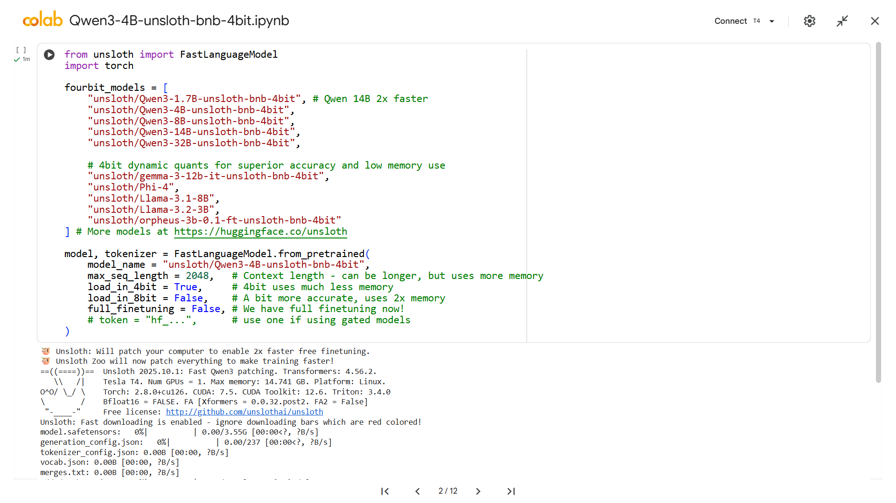


---

# Appendix
**Dataset format**
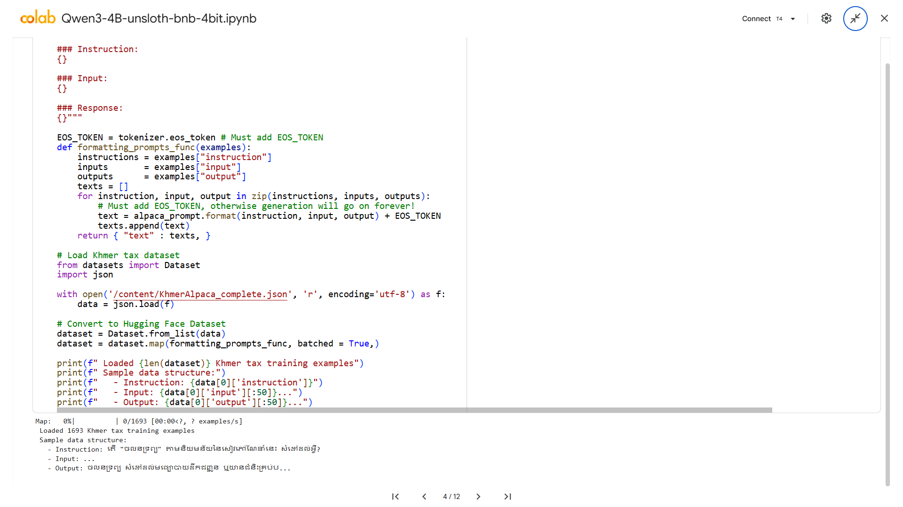


---

# Appendix
**Dataset Format**

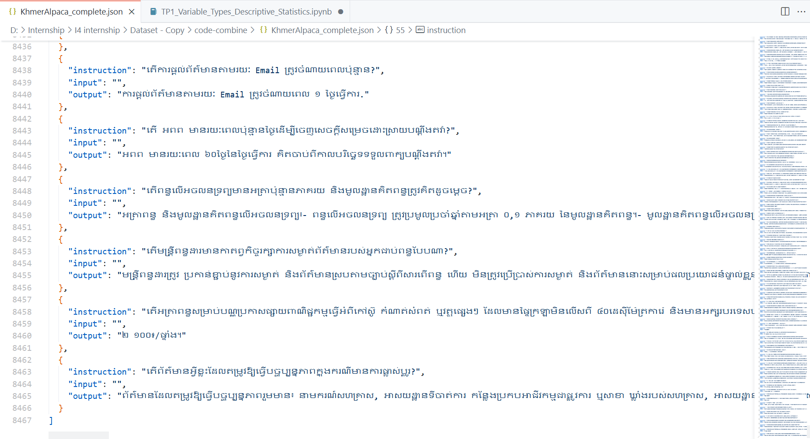


---

# Appendix
**LoRA Adapter**


---

# Appendix
**Hyperparameters Tuning**
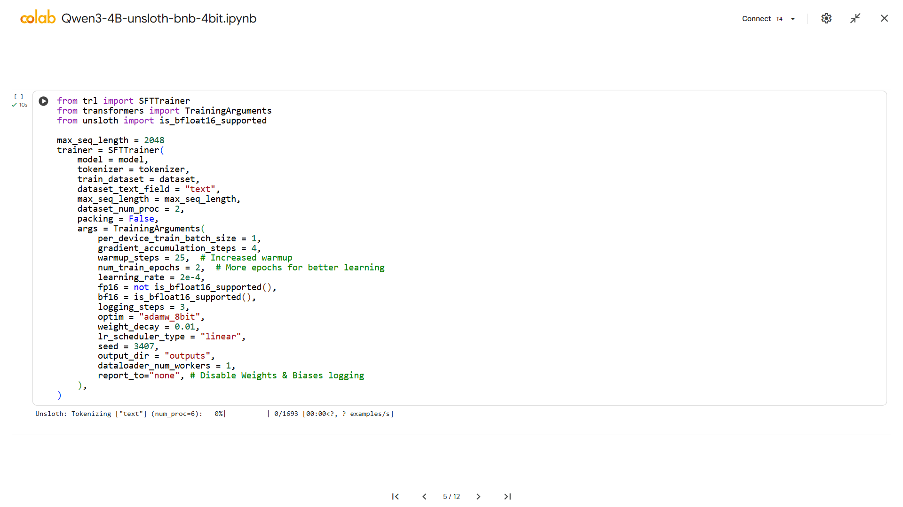
---

# Appendix
**Training**

---

# Appendix
**Inference**
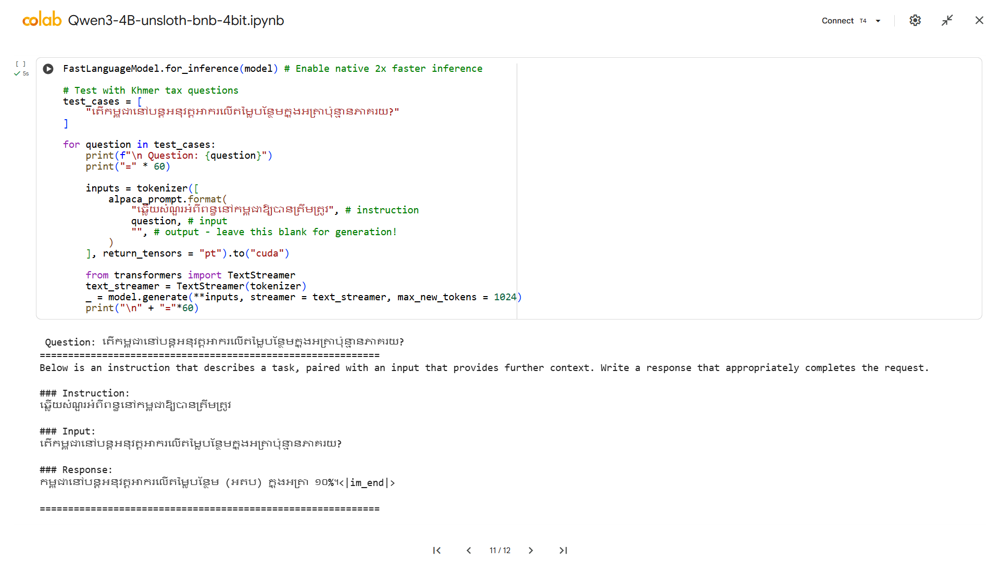

---

# Appendix
**Inference**

---
# LoRA paper


---
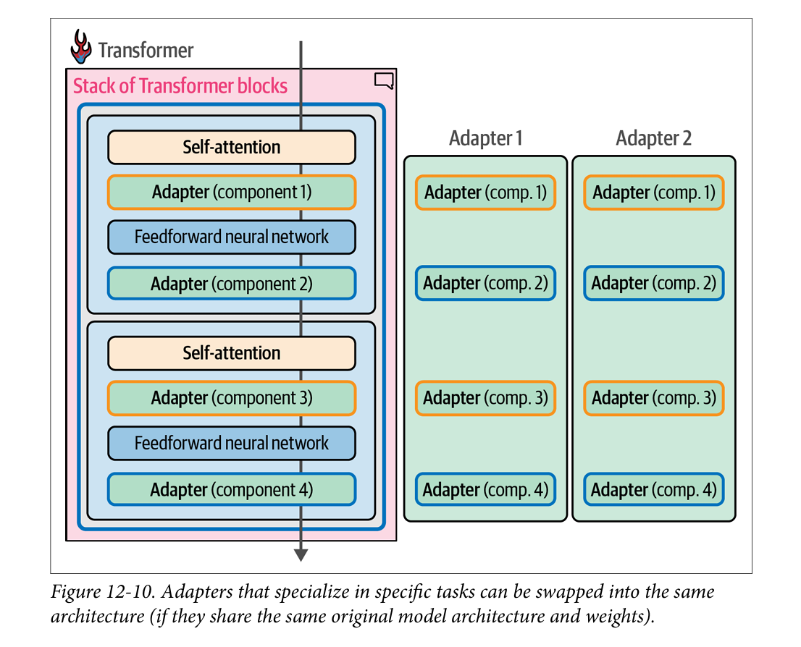

---


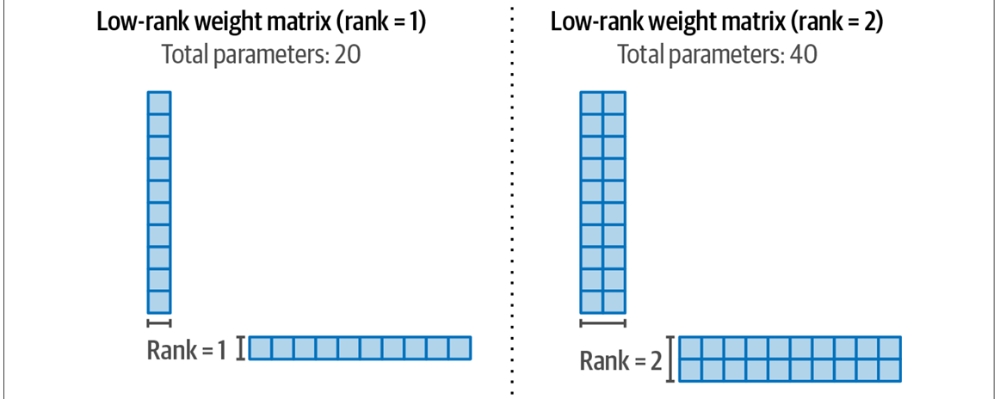

---
# Full fine-tuning and Low-Rank Adaptation (LoRA)
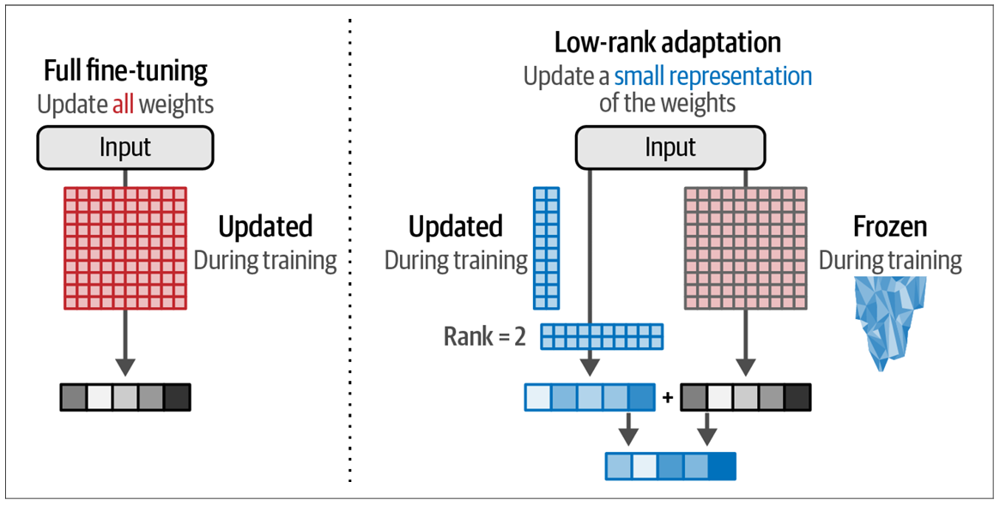
---
**Quantization**
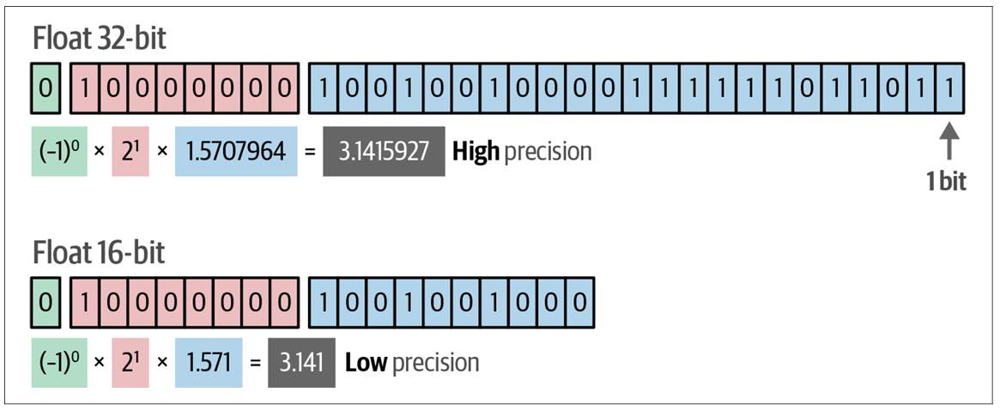
--
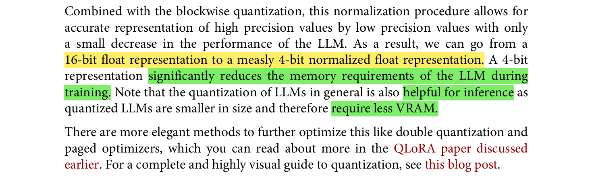
<div style="font-size: 80%; color: #555;">
Ref: [Book] <a href="https://www.llm-book.com/">Hands-On Large Language Models (page 367)</a>
</div>

---

.pull-left[
### 🔢 Cross Entropy Loss

Let $n$ be the number of samples:

$\text{Cross Entropy Loss} = \frac{1}{n} \sum_{i=1}^n \left[ -y_i \log(P_i) \right]$

Where: $P_i = \frac{\exp(x_i)}{\sum_j \exp(x_j)}$

Single-sample CE:

$\text{CE}_i = -y \log(p)$
$= -y \log\left( \frac{\exp(x)}{\sum \exp(x)} \right)$

$$ = -y \left[ x - \log\left( \sum \exp(x) \right) \right]$$
$$= y \left( \log\left( \sum \exp(x) \right) - x \right)$$
Special cases:

- If $y = 0$: $\text{CE}_i = 0$
- If $y = 1$: $\text{CE}_i = \log\left( \sum \exp(x) \right) - x$
]

.pull-right[
### ⚙️ LogSumExp Stability

Let:

$$y = \log\left( \sum \exp(x) \right)
\Rightarrow \exp(y) = \sum \exp(x)$$

Rewrite using a constant $c$:

$\exp(y) = \sum \exp(x - c) \cdot \exp(c)$
$= \exp(c) \cdot \sum \exp(x - c)$

Then:

$y = \log\left( \exp(c) \cdot \sum \exp(x - c) \right)$
$= c + \log\left( \sum \exp(x - c) \right)$

✅ Choose $c = \max(x)$ to ensure numerical stability:

$$
\exp(x - \max(x)) \leq 1 \quad \text{since} \quad \exp(0) = 1
$$
]

---
.pull-left[
### 🔁 Forward Pass

- Inputs: logits $x_j$, label $\ell$, optional scaling $s$ and softcap $t$
- Transform:  
  $$z_j = g(x_j)$$ where  
  $$g(x) = s x, t \tanh(x/t), or \
  t \tanh(sx/t)$$
- Stable logsumexp:  
  $$c = \max_j z_j \\  
  logsumexp(z) = c + \log \sum_j \exp(z_j - c)$$
- Loss:  
  $$L = 1_{\ell \ne -100} (logsumexp(z) - z_\ell)$$
]

.pull-right[
### 🔄 Backward Pass

- Softmax:  
  $$p_j = \exp(z_j - logsumexp(z))$$
- Gradient:  
  $$\frac{\partial L}{\partial z_j} = 1_{\ell \ne -100} (p_j - 1_{j = \ell})$$
- Chain rule:  
  $$\frac{\partial L}{\partial x_j} = \frac{\partial L}{\partial z_j} \cdot g'(x_j)$$
- Derivatives:  
  $$g'(x) = s, 1 - \tanh^2(x/t), \\ s(1 - \tanh^2(sx/t))$$
- Final:  
  $\text{grad}_j = \delta \cdot \frac{\partial L}{\partial x_j}$
]

---
# Source


.foot-note[
[Github link](https://github.com/unslothai/unsloth/tree/main/unsloth/kernels)
]


